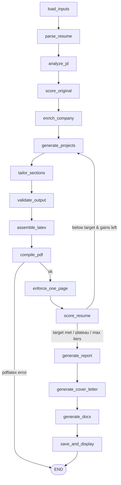

# 🎯 ResumeForge

**An AI agent that tailors your résumé to any job description — strictly one page, fully free to run, and you never touch LaTeX.**

[](https://github.com/abandonedmonk/ResumeForge/actions/workflows/ci.yml)
[](LICENSE)
[](pyproject.toml)

Paste a job description (or a posting URL). ResumeForge picks your most relevant projects and skills, rewrites your bullets for ATS, compiles a clean one-page PDF (and a `.docx`), scores the match, and auto-optimizes — then tells you exactly what changed and why.

<!-- TODO(hero): add a screenshot or GIF of the Gradio UI / a before→after PDF here -->

---

## Why ResumeForge

- **100% free to run** — cascades across free LLM providers (Groq → OpenRouter → Gemini → Cohere → GitHub Models) with **multi-key rotation + backoff** to dodge rate limits. No paid key required.
- **Premium-ready** — bring your own GPT / Claude / paid Gemini key (via `.env` or pasted in the UI) and flip `model_tier: premium`.
- **Strictly one page** — a deterministic condense loop trims to fit, then AI polishes; auto-allows a 2nd page only for 10+ years of experience or an explicit opt-in.
- **You never write LaTeX** — the AI emits content with `**bold**` markers; Python owns all LaTeX assembly. Vetted one-page templates (`classic`, `modern`).
- **Zero-friction onboarding** — build your profile from **GitHub repo URLs** (reads each README) or by **uploading an existing résumé PDF**; or fill simple forms. No hand-authored input files.
- **One-command setup** — `run.sh` / `run.bat` bootstraps the venv, installs deps, and installs a **minimal TinyTeX** (only the ~14 LaTeX packages used — no 4 GB distro), then launches.

## Feature matrix

| Area | What you get |
|---|---|
| LLM access | Free cascade + multi-key rotation · tiered **free / premium / custom** chains · session keys pasted in-UI (never persisted) |
| Tailoring | Two-stage rewrite (ATS reasoning → prose polish) · grounded, never fabricates · keeps every metric |
| ATS scoring | Keyword + semantic + section-quality + placement + impact sub-scores · **auto-optimize loop** to a target with before→after delta |
| Output | One-page **PDF** · clean ATS-friendly **DOCX** · optional **cover letter** · "what changed & why" report · version history |
| Ingestion | **GitHub** project import · **résumé-PDF** auto-fill · structured profile forms · **JD-from-URL** |
| Run anywhere | One-command `run.sh`/`run.ps1`/`run.bat` · **Docker** (`docker compose up`) · minimal TinyTeX, no admin |

## Quick Start

```bash
git clone https://github.com/abandonedmonk/ResumeForge.git
cd ResumeForge
cp .env.example .env          # paste at least one key, e.g. GROQ_API_KEY

# Linux/macOS:
./run.sh
# Windows (or double-click run.bat):
powershell -ExecutionPolicy Bypass -File run.ps1
```

First run creates the venv, installs dependencies, and — if `pdflatex` isn't already present — installs a minimal TinyTeX (one-time). The UI opens at `http://localhost:7860`.

**Docker:** `cp .env.example .env` then `docker compose up --build` → `http://localhost:7860`.

Get a free key in ~1 minute: [Groq](https://console.groq.com) · [Google AI Studio](https://aistudio.google.com/apikey) · [OpenRouter](https://openrouter.ai/keys) · [Cohere](https://dashboard.cohere.com).

## How it works



The AI only writes **content**; `app/parsers/latex_assembler.py` converts `**bold**` → `\textbf{}` and injects it into the template's placeholder regions. The optimize loop re-tailors (grounded in each project's full body) until it hits the target ATS score, plateaus, or maxes out — so the loop always terminates.

## Build your profile (pick one)

- **From GitHub** — paste repo URLs in the *Build Profile from GitHub* tab; ResumeForge reads each README and writes a reusable project profile.
- **From an existing PDF** — upload your current résumé in *Build My Profile*; links are extracted reliably and text is parsed (best-effort) to pre-fill the forms.
- **By hand** — fill the contact/education/experience/certifications forms; ResumeForge renders your personal one-page template.

Your personal data stays local (gitignored `examples/my_profile/`); the repo ships only neutral examples.

## Documentation

- [Setup guide](docs/SETUP.md) · [Linux setup](docs/linux_setup.md)
- [Architecture](docs/ARCHITECTURE.md) · [File structure](docs/FILE_STRUCTURE.md)
- [Roadmap](docs/ROADMAP.md) · [Changelog](CHANGELOG.md) · [Contributing](CONTRIBUTING.md)

## License

[MIT](LICENSE).
