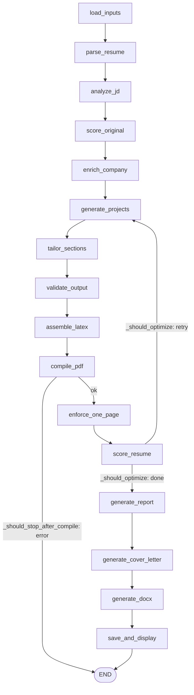

# 🏗️ Architecture — ResumeForge

ResumeForge is a [LangGraph](https://github.com/langchain-ai/langgraph) agent wrapped in a Gradio UI. The AI writes **content only** (text with `**bold**` markers); Python owns all LaTeX assembly, scoring, and file I/O. This keeps output deterministic and lets any free LLM drive it.

## Pipeline

The graph is built in [`app/agent/graph.py`](../app/agent/graph.py) (`build_graph`), run via `run_agent(initial_state)` with `recursion_limit: 50` (the optimize loop revisits nodes).

| Node | Role |
|---|---|
| `load_inputs` | Resolve JD / skills / projects / résumé template; apply config + session overrides; fetch JD-from-URL; prefer imported profiles & the personal template when present. |
| `parse_resume` | Split the template into sections (`\section{}`) and bullets; parse project profiles. |
| `analyze_jd` | LLM extracts required/nice-to-have skills, keywords, tone, role, company. |
| `score_original` | Baseline ATS score of the untailored résumé (the "before"). |
| `enrich_company` | Optional web-search context (off by default). |
| `generate_projects` | Select + write project bullets grounded in each project's full body. |
| `tailor_sections` | Two-stage rewrite of non-fixed sections: Stage 1 (reasoning, temp 0.2) for ATS/keywords, Stage 2 (writing, temp 0.4) for prose. |
| `validate_output` | Structural checks; revert sections that fail (keep originals). |
| `assemble_latex` | Inject headline/skills/projects + tailored bullets into the template placeholders. |
| `compile_pdf` | Run `pdflatex` twice; parse the page count. |
| `enforce_one_page` | Deterministically trim to the page budget, then optional AI shortening. |
| `score_resume` | Re-score the tailored résumé; record the optimization scores. |
| `generate_report` | Synthesize the before→after / changes report + `optimization_summary`. |
| `generate_cover_letter` | Optional (flag-gated) cover letter from the tailored highlights. |
| `generate_docx` | Clean ATS `.docx` rebuilt from the final content. |
| `save_and_display` | Stage the preview; on approval, save PDF/DOCX/cover-letter to `dest_folder` + history. |

**Conditional edges:** `_should_stop_after_compile` ends the run on a `pdflatex` failure; `_should_optimize` loops back to `generate_projects` while below the target score and still gaining, stopping on target met / plateau / `max_optimize_iterations` (so it always terminates).

## The two-stage rewrite

`tailor_sections` mirrors the manual "two models, two jobs" workflow: **Stage 1** (reasoning, low temp) restructures bullets for ATS keyword coverage; **Stage 2** (writing, higher temp) makes them read like a senior engineer wrote them. Processing section-by-section means no single call ever hits a token limit, and every original metric is preserved.

## LLM layer ([`app/llm/`](../app/llm/))

`RoutedModel(stage, tier, task)` ([`router.py`](../app/llm/router.py)) is the single entry point for every LLM call. `stage` is `stage1` (reasoning) or `stage2` (writing); `tier` selects a provider chain:

- **free** (default): `groq → openrouter → gemini → cohere → copilot`
- **premium**: `openai → anthropic → gemini → groq` (bring your own key)
- **custom**: your `fallback_chain`

**Task-aware routing** ([`task_routing.py`](../app/llm/task_routing.py)): the optional `task` argument (`ats_scoring`, `project_generation`, `tailor`, …) reorders the chain so each job goes to the best provider that actually has a key — e.g. Gemini scores ATS while Groq writes — filtered to live providers via `keypool.available_providers`, with the tier chain as fallback. `task=None` keeps the original two-stage behavior exactly.

**Token-budget awareness** ([`model_limits.py`](../app/llm/model_limits.py)): each model has an effective free-tier input/output budget. `RoutedModel.call` estimates the prompt, **skips to a bigger-context model** when the preferred one won't fit, and **trims the input only as a last resort** (with a visible marker + WARN). Output is capped per model so the *total* stays under limits (Groq's free tier is ~12k total per request). See [PROVIDERS.md](PROVIDERS.md) for the user-facing guide.

For each provider, `keypool.ordered_keys` ([`keypool.py`](../app/llm/keypool.py)) yields every available key (`NAME`, `NAME_1`, … plus a UI session key from [`keystore.py`](../app/llm/keystore.py)), rotating the start offset and backing off on rate limits before failing over to the next provider. Adding a provider = a `BaseLLM` subclass + an entry in `_PROVIDERS` and `PROVIDER_ENV`.

## Config ([`app/utils/config.py`](../app/utils/config.py))

Layered, last wins: `config.yaml` (tracked defaults) → `config.local.yaml` (gitignored personal values) → per-thread session overrides (UI selections). `get_config()` returns a deepcopy so concurrent Gradio sessions stay isolated.

## Ingestion (Phases 5–7)

- **GitHub** ([`integrations/github.py`](../app/integrations/github.py), `profile_builder.py`): repo URL → README → grounded project profile (`.md`).
- **Résumé PDF** ([`integrations/resume_pdf.py`](../app/integrations/resume_pdf.py), `resume_import.py`): text + link extraction → LLM → structured `Profile`.
- **Profile → template** ([`parsers/profile_template_builder.py`](../app/parsers/profile_template_builder.py)): renders a personal one-page `template.tex` from the `Profile` ([`profiles/schema.py`](../app/profiles/schema.py)), self-checked by compiling.
- **JD-from-URL** ([`parsers/jd_parser.py`](../app/parsers/jd_parser.py)): `requests` + BeautifulSoup.
- **TeX bootstrap** ([`utils/tex_bootstrap.py`](../app/utils/tex_bootstrap.py)): minimal TinyTeX install + the exact `tlmgr` package set.

## Scoring

See [`ATS_Planner.md`](ATS_Planner.md) for the scoring design. `compute_ats_score` ([`app/agent/nodes/score_resume.py`](../app/agent/nodes/score_resume.py)) combines keyword match, semantic context, section quality, keyword placement, and impact metrics (weights in `config.yaml`).
